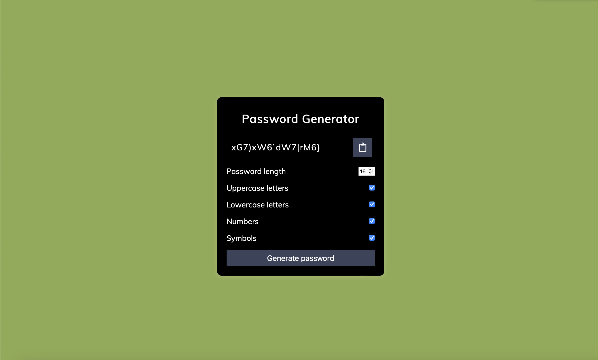

# Password Generator

Created by: Zakaria Chowdhury

The following can be done:

* The generator allows you to check categories of what elements should be in the generated password. By default, everything will be included
* The length of the password can be chosen. It has current bounds of 4 to 30 inclusive, but can be adjusted in index.html under the ID "number".

[Click here](https://zc82531.github.io/Password-Generator/){:target="_blank"} to view the site.

  

## License

    Copyright 2024 Zakaria Chowdhury

    Licensed under the Apache License, Version 2.0 (the "License");
    you may not use this file except in compliance with the License.
    You may obtain a copy of the License at

        http://www.apache.org/licenses/LICENSE-2.0

    Unless required by applicable law or agreed to in writing, software
    distributed under the License is distributed on an "AS IS" BASIS,
    WITHOUT WARRANTIES OR CONDITIONS OF ANY KIND, either express or implied.
    See the License for the specific language governing permissions and
    limitations under the License.

# Password-Generator
